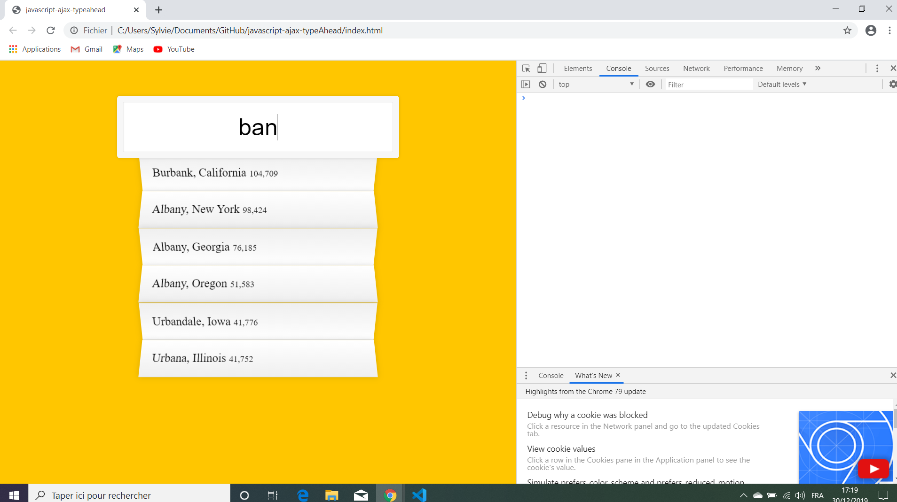

# Javascript Ajax Type-ahead

Wes Bos Youtube Tutorial: [Ajax Type Ahead with fetch() - #JavaScript30 6/30](https://www.youtube.com/watch?v=y4gZMJKAeWs&list=PLu8EoSxDXHP6CGK4YVJhL_VWetA865GOH&index=6).


*** Note: to open web links in a new window use: _ctrl+click on link_**

## Table of contents

* [General info](#general-info)
* [Screenshots](#screenshots)
* [Technologies](#technologies)
* [Setup](#setup)
* [Features](#features)
* [Status](#status)
* [Inspiration](#inspiration)
* [Contact](#contact)

## General info

* Tutorial Code using javascript & AJAX to add suggestions when typing into text box. 

## Screenshots

.

## Technologies

* [Javascript v1.9 ECMA-262 ECMAScript 2018](http://www.ecma-international.org/publications/standards/Ecma-262.htm)
* [jQuery slim CDN v3.3.1"](https://code.jquery.com/)
* [Bootstrap CDN v4.3.1](https://getbootstrap.com/docs/4.3/getting-started/introduction/)
* [JSON endpoint list of cities with data.](https://gist.githubusercontent.com/Miserlou/c5cd8364bf9b2420bb29/raw/2bf258763cdddd704f8ffd3ea9a3e81d25e2c6f6/cities.json)

## Setup

* Open index.html in browser. If any code is changed the browser needs to be refreshed.

## Code Examples

* Function to match search string with city or state name.

```javascript

function findMatches(wordToMatch, cities) {
  return cities.filter(place => {
  
    const regex = new RegExp(wordToMatch, 'gi');
    return place.city.match(regex) || place.state.match(regex)
  });
}
```

## Features

*  Function to add comas in population number. Latest versions of jQuery Slim, AJAX and Bootstrap used

## Status & To-Do List

* Status: Working.

* To-Do: N/A

## Inspiration

* Wes Bos Youtube Tutorial: [Ajax Type Ahead with fetch() - #JavaScript30 6/30](https://www.youtube.com/watch?v=y4gZMJKAeWs&list=PLu8EoSxDXHP6CGK4YVJhL_VWetA865GOH&index=6)

## Contact

Repo created by [ABateman](https://www.andrewbateman.org) - feel free to contact me!
